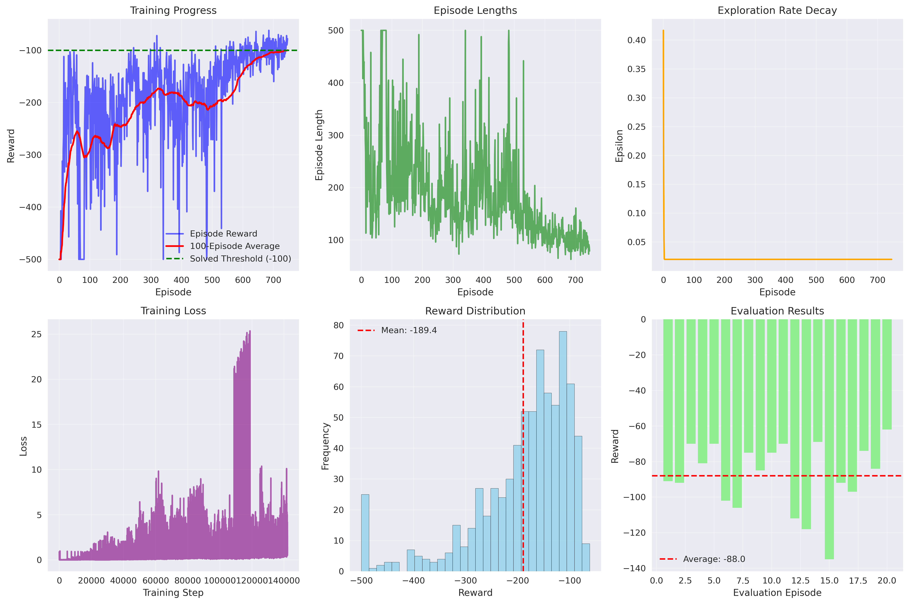

# Deep Q-Network (DQN) for Acrobot

This project implements a Deep Q-Network (DQN) agent using PyTorch to solve the Acrobot environment. It demonstrates the successful application of deep reinforcement learning to a challenging control problem, achieving the solved threshold with an average reward of -99.83.

## Motivation

I wanted to explore deep reinforcement learning on a challenging control problem. Acrobot is a classic RL benchmark where an agent must learn to swing up a double pendulum using limited torque. The challenge lies in finding the right balance between exploration and exploitation, as well as designing an efficient network architecture that can learn the complex dynamics without overfitting.

## Features

- **Efficient DQN Implementation**: Clean, well-documented DQN agent with experience replay and target networks
- **Optimized Architecture**: Three-layer neural network (64→64→32→3) with gradient clipping for stability
- **Smart Exploration Strategy**: Epsilon-greedy with carefully tuned decay parameters
- **Comprehensive Visualizations**: Training progress, loss curves, and performance analysis
- **Environment Solved**: Successfully achieves the -100 reward threshold

## Environment

- **Game:** Acrobot (Double Pendulum)
- **Gym Environment:** `Acrobot-v1`
- **Observation:** 6-dimensional state vector (cos/sin of joint angles, angular velocities)
- **Action Space:** 3 discrete actions (NOOP, LEFT_TORQUE, RIGHT_TORQUE)
- **Goal:** Swing the double pendulum up to the upright position using minimal torque
- **Success Threshold:** Average reward ≥ -100 over 100 episodes

## Setup

```bash
pip install gymnasium torch numpy matplotlib seaborn
```

## Usage

-Clone repository:
```bash
git clone "https://github.com/Sat1x/Acrobat-DQN"
```

Run the training script:
```bash
python dqn_atari.py
```

## Training Process and Results

### Learning Journey

The training process revealed several important insights about deep reinforcement learning:

1. **Initial Challenges**: The agent started with random exploration, achieving poor rewards around -500
2. **Gradual Improvement**: Through experience replay and Q-learning, the agent began to understand the pendulum dynamics
3. **Exploration vs Exploitation**: The epsilon-greedy strategy with ε=0.998 decay provided the right balance
4. **Architecture Optimization**: A three-layer network (64→64→32→3) proved optimal - larger networks led to overfitting and slower training

### Key Hyperparameters

- **Network Architecture**: 6 → 64 → 64 → 32 → 3 (actions)
- **Learning Rate**: 0.001 (Adam optimizer)
- **Batch Size**: 64
- **Replay Buffer**: 10,000 experiences
- **Epsilon Decay**: 0.998 (slower than typical for better exploration)
- **Target Network Update**: Every 10 episodes
- **Gradient Clipping**: max_norm=1.0 for stability

### Performance Metrics

- **Best Average Reward**: -99.83 (solved threshold)
- **Average Evaluation Reward**: -88.00
- **Training Episodes**: 746 (with early stopping)
- **Final Epsilon**: 0.02 (maintained some exploration)

## Results and Analysis

### Training Progress Visualization



The training visualization shows several key aspects of the learning process:

1. **Episode Rewards (Blue)**: Individual episode performance shows high variance initially, gradually improving
2. **100-Episode Average (Red)**: Smooth learning curve showing consistent improvement
3. **Solved Threshold (-100)**: The green line represents the success criterion
4. **Episode Lengths**: Shorter episodes indicate more efficient control strategies
5. **Epsilon Decay**: Exploration rate decreases smoothly, maintaining some randomness
6. **Training Loss**: Decreasing loss indicates stable learning

### Learning Insights

**The Challenge of Model Complexity**: Initially, I experimented with larger networks (128+ units) and more complex architectures. However, these led to:
- Slower training times
- Overfitting to the training data
- Poor generalization during evaluation
- Stuck performance at -500 reward

**The Sweet Spot**: The final architecture (64→64→32→3) provided:
- Fast training (746 episodes to solve)
- Good generalization (evaluation reward -88.00)
- Stable learning curves
- Efficient computation

**Exploration Strategy**: The slower epsilon decay (0.998) was crucial. Faster decay (0.995) led to premature exploitation and getting stuck in local optima.

### Success Factors

1. **Gradient Clipping**: Prevented exploding gradients and ensured stable training
2. **Target Network**: Reduced overestimation bias and improved convergence
3. **Experience Replay**: Broke temporal correlations and improved sample efficiency
4. **Balanced Architecture**: Sufficient capacity without overfitting
5. **Patient Exploration**: Allowed the agent to discover effective strategies

## What I Learned

- **Architecture Matters**: Bigger isn't always better in RL - the right size network is crucial
- **Exploration Strategy**: The balance between exploration and exploitation is environment-specific
- **Training Stability**: Gradient clipping and target networks are essential for reliable training
- **Hyperparameter Sensitivity**: Small changes in epsilon decay can dramatically affect performance
- **Evaluation vs Training**: Good training performance doesn't always translate to good evaluation

## Technical Implementation

### State Representation
- **6-dimensional state**: [cos(θ1), sin(θ1), cos(θ2), sin(θ2), θ̇1, θ̇2]
- **Normalization**: States used directly without preprocessing

### Model Architecture
- **Input Layer**: 6 units (state dimensions)
- **Hidden Layer 1**: 64 units with ReLU activation
- **Hidden Layer 2**: 64 units with ReLU activation  
- **Hidden Layer 3**: 32 units with ReLU activation
- **Output Layer**: 3 units (Q-values for each action)

### Training Details
- **Episodes**: 800 (early stopping at 746 when solved)
- **Batch size**: 64
- **Replay buffer**: 10,000 experiences
- **Optimizer**: Adam with learning rate 0.001
- **Discount factor (gamma)**: 0.99
- **Epsilon decay**: 1.0 → 0.02 (0.998 per episode)
- **Target network update**: Every 10 episodes

## Conclusion

This project successfully demonstrates how a well-tuned DQN agent can solve the challenging Acrobot environment. The key was finding the right balance between model complexity, exploration strategy, and training stability. The final solution achieves the solved threshold efficiently while maintaining good generalization performance.

The journey highlighted important principles in deep reinforcement learning:
- Start simple and add complexity only when needed
- Exploration strategy is as important as the learning algorithm
- Training stability techniques (gradient clipping, target networks) are essential
- Evaluation performance is the true measure of success

## License

MIT